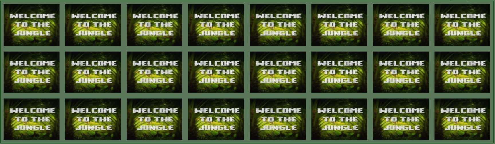

# Animal Memory

Animal Memory is a simple game of memory that can be played on any device. It does not matter if you are a child that is trying the game for the first time, or an experienced adult. Animal memory provides difficulties suitable for all users.

## Features

### Header with Difficulties and Attempts Counter

On the top of the page you find a simple header containing the name of the page "Animal Memory". Beneth the header there is an option to select the difficulty you wish to play on rangeing from easy to hard. Each difficulty level represents the number of attempts the player has to solve the memory game. If a player is mid game and tries to switch difficulty it resets the game by unflipping all cards, re-shuffeling the board and reseting the number of attempts.

Next to the difficulties you find an attempt counter. The counter starts at the max number of attempts the player has and subtracts one attempt for each wrong guess the player makes. When the number of attempts reaches zero the game is over and no more cards can be clicked.

### Memory Game

The rest of the page consists of the game area containing 24 cards of 12 different animals. The game is simple, click a card to make it flip and show the animal on the other side, then click another card. If the two animals are the same you get a point and the cards remain facig animal side up. If the cards dont match the cards will be flipped back and your job is to try to memorize the position of the animals until you encounter its matching counterpart.

## Features Left to Implement

I think that the game lacks the option to chose the number of cards you want to play with. So a feature that either adds more memory cards to the game or removes cards from the game to change the difficulty of it would be a good thing to add.

## Testing

Every time a new feature was implemented some testing had to be made to see if the code worked well together.

I started by creating the game area and the memory cards. To see if the cards worked as intended i tested them by clicking the cards to make them flip. If I got a match the animals were supposed to stay visable. When two cards did not match they had to get flipped back after 1.5 seconds. I tried spam clicking many cards after I had clicked two cards to make sure it was not possible to flip cards before the reflipping animation was done.

I refreshed the page many times to make sure the cards were shuffled and placed on a random spot each time the page was refreshed.

When I added the difficultiy buttons I had to make sure the correct number of attempts were added to the corresponding button. This was done by selecting a difficulty and checking if the correct number of "remaining attempts" was dispalyed on the top right. I also tried to use all of the attempts on each difficulty to see if the "gameOver" was implemented which locks the board preventing the player from keep on playing the game.

If a player was in the middle of playing the game and decided to change difficulty the cards that were already showing had to get reflipped and reshuffled. At first the cards did this in the wrong order which made it possible for the player to see the new position of the cards they had already flipped when a new game started. A function was created that made the cards flip back to show the backside before shuffeling the cards again. 